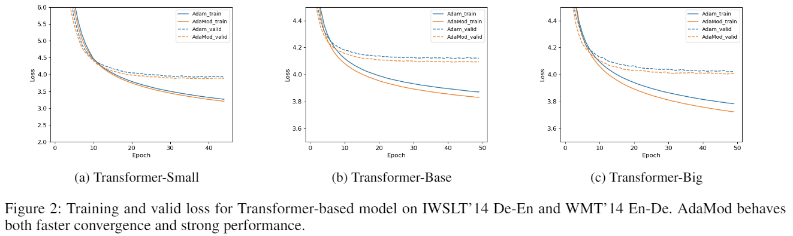

# AdaMod

An optimizer which exerts adaptive momental upper bounds on individual learning rates to prevent them becoming undesirably lager than what the historical statistics suggest and avoid the non-convergence issue, thus to a better performance. Strong empirical results on many deep learning applications demonstrate the effectiveness of our proposed method especially on complex networks such as DenseNet and Transformer.

<p align='center'></p>

## Installation

AdaMod requires Python 3.6.0 or later.

### Installing via pip

The preferred way to install AdaMod is via `pip` with a virtual environment.
Just run 
```bash
pip install adamod
```
in your Python environment and you are ready to go!

### Using source code

As AdaMod is a Python class with only 100+ lines, an alternative way is directly downloading
[adamod.py](./adamod/adamod.py) and copying it to your project.

## Usage

You can use AdaMod just like any other PyTorch optimizers.

```python3
optimizer = adamod.AdaMod(model.parameters(), lr=1e-3, beta3=0.999)
```
As described in the paper, AdaMod can smooths out unexpected large learning rates throughout the training process. The `beta3` parameter is the smoothing coefficient for actual learning rate, which controls the average range. In common cases, a `beta3` in `{0.999,0.9999}` can achieve relatively good and stable results. See the paper for more details.

## Demos

For the full list of demos, please refer to [this page](./demos).

## Contributors

[@luoruixuan](https://github.com/luoruixuan)


